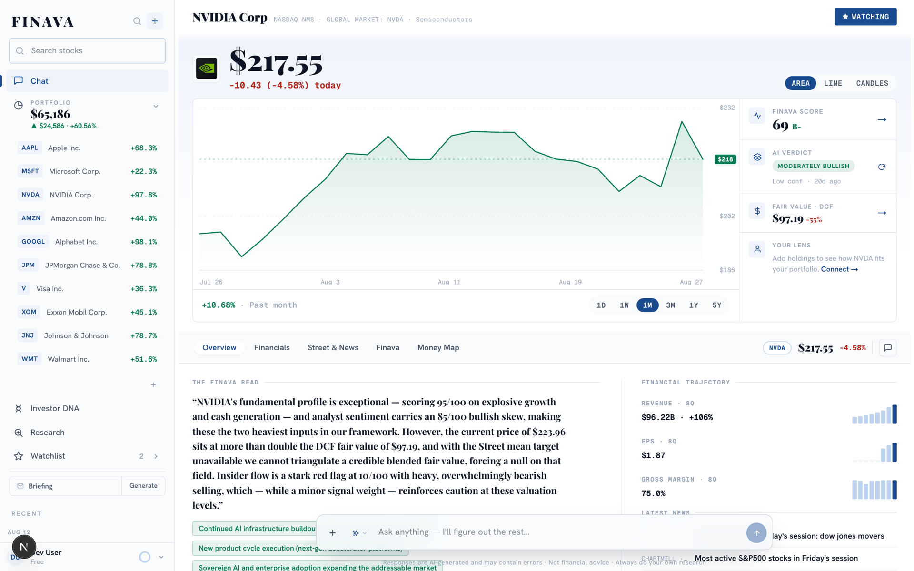
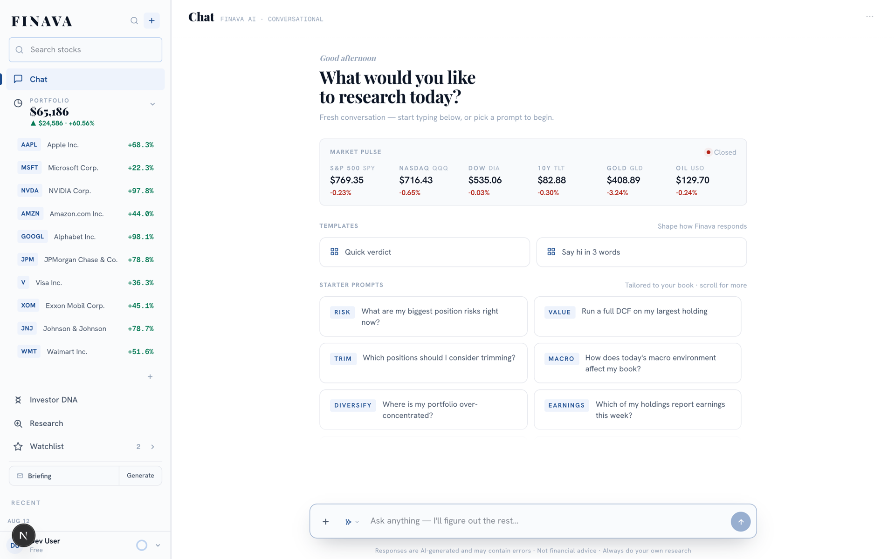
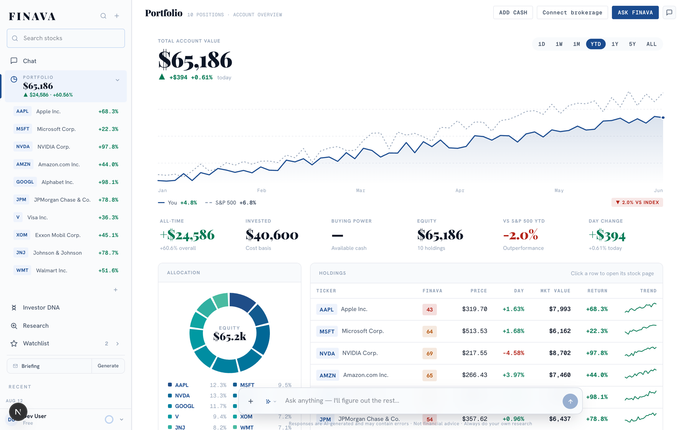
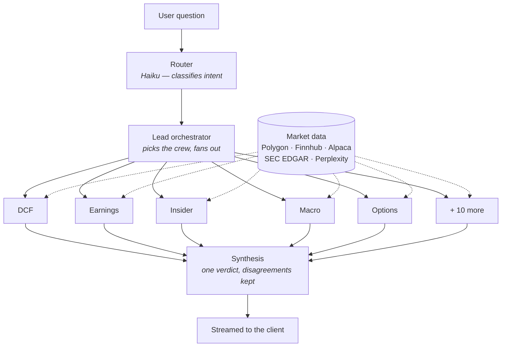

<h1>Finava</h1>

<p><strong>15 AI analysts. One conversation.</strong><br>
An AI equity research platform that gives individual investors the kind of coverage a research desk gets — a full analyst crew that reads the filings, runs the model, and argues about the answer.</p>

<p>
  <a href="https://github.com/LBB2005/finava/actions/workflows/ci.yml"></a>
  
  
  
  
  
</p>

<p><a href="https://finava.ai"><strong>finava.ai</strong></a> · currently in private beta</p>



---

## The problem

Retail investing tools split into two camps. Screeners like Finviz give you every number and no interpretation — you're on your own to decide what a 12% gross-margin decline means. Robo-advisors give you interpretation and no transparency — a recommendation with no visible reasoning behind it.

Neither does what a real research desk does: assign the question to specialists, let them disagree, and synthesize a view you can interrogate.

Finava is that desk. Ask about a stock and fifteen specialist agents — DCF, earnings, insider flow, macro, options positioning, competitive dynamics, and more — each run their own analysis against live market data, then a lead agent synthesizes them into a single written verdict with the disagreements left visible.

## What it does

|   | |
|---|---|
| **Deep research** | 15 specialist agents analyze a ticker in parallel, streamed live as each one finishes |
| **Finava Score** | A deterministic 15-factor, 6-pillar composite computed from real fundamentals — not an LLM guess |
| **Interactive DCF** | A real discounted-cash-flow model with adjustable assumptions, not a static number |
| **Portfolio intelligence** | Link a brokerage via Plaid; get position-aware analysis benchmarked against the S&P 500 |
| **Investor DNA** | Infers your investing style from your actual holdings and P&L, then frames every stock through that lens |
| **Research board** | A scored, filterable leaderboard across the S&P 500 |

<table>
<tr>
<td width="50%"></td>
<td width="50%"></td>
</tr>
<tr>
<td align="center"><em>Chat — portfolio-aware from the first message</em></td>
<td align="center"><em>Portfolio — benchmarked, scored per holding</em></td>
</tr>
</table>

## How it works

A lead orchestrator decides which specialists a question actually needs, fans them out concurrently, and synthesizes their returns. Each agent is an isolated module with its own prompt, its own tools, and its own test file.



**Models are routed per agent rather than picked globally.** Each specialist runs on the model calibrated for its job, and the UI badges which one produced what — so the reasoning stays attributable:

| Brand | Role |
|---|---|
| Claude (Sonnet 4.6 / Haiku 4.5) | Synthesis and judgment |
| GPT-5.5 | The numbers |
| Gemini 2.5 Flash | High-volume reading |
| Grok 4.3 | Live social signal |
| Perplexity | Live web grounding |

## Engineering notes

The parts that were harder than they look:

- **Concurrent streaming** — a headless chat engine lets multiple conversations stream simultaneously, with optimistic UI that survives a reload mid-run.
- **Cost control** — every LLM call is metered per user through an `AsyncLocalStorage` context, with a cost-weighted credit system, an in-run kill-switch that aborts a runaway agent mid-execution, and automatic provider failover.
- **Tenant isolation** — agent memory and the risk cache are partitioned by user ID. A shared cache key across tenants is the kind of bug that leaks one user's portfolio into another's analysis.
- **No-fabrication guardrail** — a shared accuracy rule is injected into every report prompt. Agents must return an explicit *Unavailable* rather than inventing a plausible number, which matters more in finance than almost anywhere else.
- **SSRF protection** — outbound fetches for user-supplied URLs resolve and pin the IP before connecting, so a hostname can't re-resolve to a private address between check and use.
- **Deterministic scoring** — the Finava Score is computed from real fundamentals in plain TypeScript. Asking a language model to produce a number and calling it a score is not a score.

Verified on the current commit: **767 tests** across **119 test files**, **81% line coverage** behind a ratchet that CI refuses to let drop, and **50 API routes**.

## Tech stack

**Framework** Next.js 16 (App Router, React 19, TypeScript)
**AI** OpenRouter → Claude · GPT · Gemini · Grok · Perplexity
**Data** Polygon · Finnhub · Alpaca · SEC EDGAR · Perplexity
**Infra** Firebase (Auth + Firestore) · Plaid · Stripe · Vercel
**Testing** Vitest with a coverage ratchet · GitHub Actions CI

## Running locally

Requires Node 22+.

```bash
git clone https://github.com/LBB2005/finava.git
cd finava
npm install
cp .env.example .env.local   # then fill in your keys
npm run dev
```

`.env.example` documents every variable and marks which are required. The server validates required vars at boot and refuses to start in production without them. Firebase and at least one market-data provider are needed for a useful local run; the rest degrade gracefully.

```bash
npm run lint        # eslint
npm run typecheck   # tsc --noEmit
npm test            # vitest
npm run test:cov    # vitest + coverage ratchet
```

CI runs all four plus a production build on every push and pull request.

## Project structure

```
src/
├── agents/          # orchestrator, 15 specialist sub-agents, skills, tools
│   ├── ceo.ts       # lead orchestrator — crew selection and synthesis
│   ├── sub-agents/  # one module + one test file per specialist
│   └── skills/      # per-agent prompts and output contracts
├── app/
│   ├── api/         # 50 route handlers
│   └── (pages)/     # stock, chat, portfolio, research, watchlist, dna
├── components/      # UI, organized by surface
├── lib/             # scoring, DCF, market-data clients, auth, metering
└── test/            # shared test setup
```

## Disclaimer

Finava is a research tool, not an investment adviser. Nothing it produces is personalized financial advice. AI-generated analysis can be wrong, and the app labels it as such throughout. Always do your own research.

## License

MIT — see [LICENSE](LICENSE).
